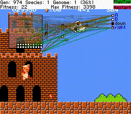

# MarI/O FCEUX
FCEUX port of [SethBling's MarI/O.][1] All credits to SethBling.

<kbd></kbd>

##Why FCEUX?
It runs on Linux.

##Instructions
1. Save neatevolve.lua somewhere on your computer.
2. Open Super Mario Bros. in FCEUX.
3. Go to some level and make a savestate at the beginning of the level. Use savestate slot 1 or edit the settings in the script.
4. Load the script in FCEUX (File -> Load Lua Script)
5. Enjoy!

If you start FCEUX from the terminal you'll get some usefull debug info.

Tested on FCEUX 2.2.2 (Ubuntu 16.04). 

###Loading a previous generation
Backups of every generation will be saved in a folder called 'backups'. If you wish to load or continue from a backup, edit the settings in the script, e.g.
```
LOAD_FROM_FILE = "backups/backup.5.SMB1-1.state.pool"
```
Value 'nil' will start a new pool.
```
LOAD_FROM_FILE = nil
```
###HUD elements
You can toggle the HUD elements ON/OFF by clicking on them. Turning HUD elements (and sound) off will greatly improve performance on fast emulation speeds. There's no external gui like in BizHawk since FCEUX's lua support is more limited.

##Changes from SethBling's original script
Mostly just some gui/HUD stuff that wasn't supported in FCEUX. Otherwise it's quite vanilla. Super Mario World references were removed since FCEUX is NES only. If you know a SNES emulator that runs on linux and supports lua scripting let me know, I'd love to get this working for SMW!

[1]: https://www.youtube.com/watch?v=qv6UVOQ0F44
